# HCP Terraform – Remote Execution, Remote State & GitOps with GitHub

This repository demonstrates how to use **HCP Terraform** to manage Terraform infrastructure through remote execution, centralized state management, secure cloud credentials, and GitHub-based workflows.

The walkthrough uses an AWS EC2 example and covers:

- HCP Terraform account and organization setup
- Project and workspace creation
- CLI-driven remote execution
- Terraform CLI authentication with `terraform login`
- AWS credential configuration in HCP Terraform
- Remote Terraform plan and apply
- HCP Terraform remote state
- Terraform configuration changes
- Terraform destroy
- GitHub-based GitOps integration and pull-request validation

> **Note:** The screenshots in this README are taken from the original HCP Terraform walkthrough document supplied with this repository. Some screenshots contain blurred/redacted personal information.

---

## 1. HCP Terraform Account Setup

Start by opening the HCP Terraform login page:

**https://app.terraform.io/login**

You can create an HCP Terraform account using an email address or use an existing HashiCorp account / GitHub sign-in.

For email-based registration, the email address must be confirmed before completing the login process. GitHub-based authentication requires authorization when prompted.

The original walkthrough documents both approaches and the email-confirmation flow. fileciteturn0file0L2-L16


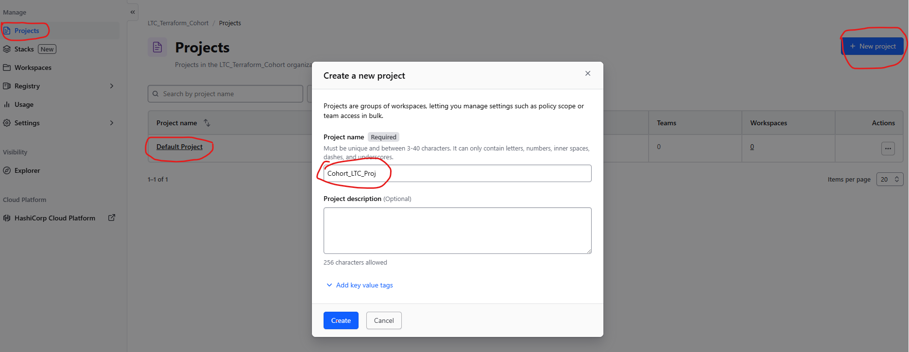

---

## 2. Create an HCP Terraform Organization

After signing in, create your first HCP Terraform organization.

Select **Create organization** and provide the required organization details.

An organization is the top-level HCP Terraform boundary used to manage projects, workspaces, teams, variables, policies, and Terraform runs.

The original walkthrough instructs the user to create the first organization after login. fileciteturn0file0L18-L20

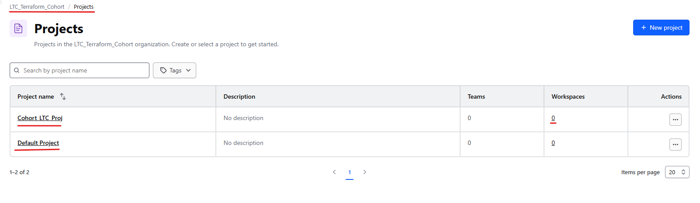

---

## 3. Create a Project

When an organization is created, HCP Terraform provides a default project.

You can either:

- Use the default project, or
- Create a dedicated project for your Terraform workloads.

For this example, a separate project is created.

Projects are useful for organizing related Terraform workspaces and controlling access at an appropriate logical boundary.

The source walkthrough describes using the default project or creating a new project. fileciteturn0file0L22-L24


---

## 4. Create the Terraform Workspace

HCP Terraform supports different workspace workflows. The walkthrough identifies three options:

| Workflow | Purpose |
|---|---|
| **Version control workflow** | Connect a workspace directly to GitHub, Bitbucket, or another supported VCS |
| **CLI-driven workflow** | Use Terraform CLI while HCP Terraform performs the remote execution |
| **API-driven workflow** | Integrate Terraform runs through the HCP Terraform API, commonly from CI/CD systems |

For the initial demonstration, select **CLI-driven workflow** and provide a workspace name.

The source document specifically chooses the CLI-driven workflow for this part of the walkthrough. fileciteturn0file0L26-L33

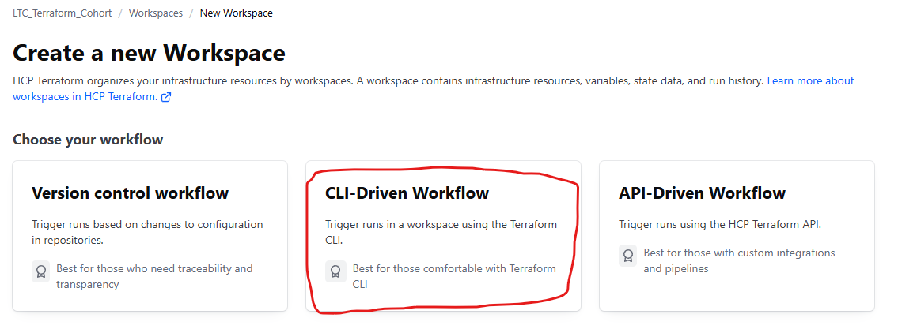

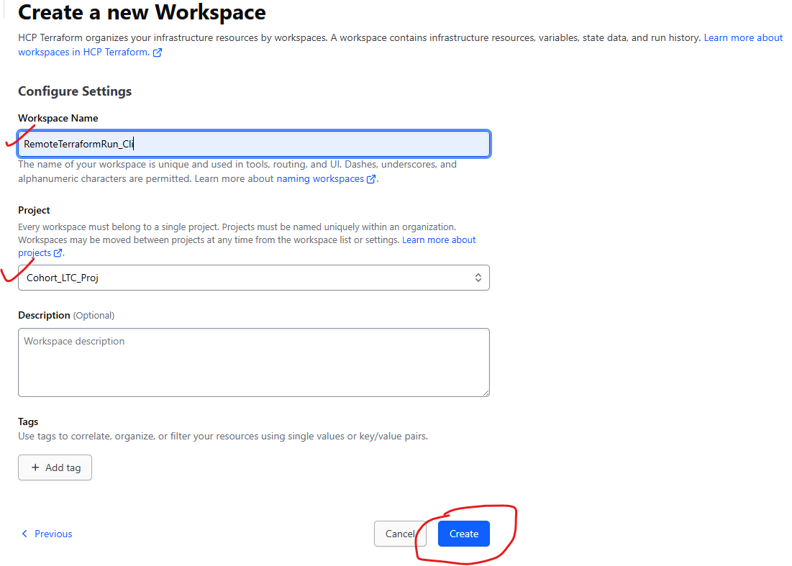

---

## 5. Configure Terraform for HCP Terraform

For a CLI-driven workspace, add an HCP Terraform `cloud` block to the Terraform configuration.

Example:

```hcl
terraform {
  required_version = ">= 1.6.0"

  cloud {
    organization = "YOUR_ORGANIZATION"

    workspaces {
      name = "YOUR_WORKSPACE"
    }
  }
}
```

For the repository used in this walkthrough, replace the organization and workspace values with the values configured in your HCP Terraform environment.

The source document demonstrates this configuration pattern and explains that Terraform uses the organization/workspace information to connect the CLI workflow to HCP Terraform. fileciteturn0file0L38-L43


---

## 6. Create an HCP Terraform API/User Token

Terraform CLI needs authentication to communicate with HCP Terraform.

From HCP Terraform, navigate to the token settings and create an appropriate token.

Recommended process:

1. Open the token settings.
2. Select **Create an API token** / the applicable user-token option.
3. Enter a meaningful description.
4. Select an appropriate expiration period.
5. Generate the token.
6. Copy the token immediately and store it securely.

The original document shows token creation and recommends keeping the generated token private. fileciteturn0file0L44-L50


> **Security:** Never commit an HCP Terraform token to GitHub. Treat it like a password.

---

## 7. Authenticate Terraform CLI

On the local machine, run:

```bash
terraform login
```

Terraform will start the authentication flow. Confirm the prompt and provide the token generated in HCP Terraform.

Example:

```text
terraform login

Terraform will request an API token for app.terraform.io using your web browser.

Do you want to proceed?
Enter a value: yes
```

The source walkthrough shows the CLI login process and the successful authentication flow. fileciteturn0file0L52-L60


After successful authentication, Terraform can communicate with the configured HCP Terraform organization and workspace.

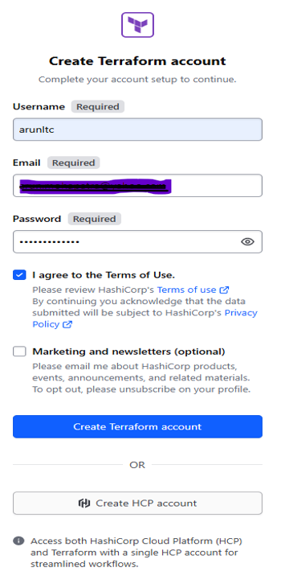

---

## 8. Initialize and Run Terraform

Once authentication is complete, initialize the Terraform working directory:

```bash
terraform init
```

Then create a plan:

```bash
terraform plan
```

To execute the configuration:

```bash
terraform apply
```

Because the Terraform configuration contains the HCP Terraform `cloud` block, the configured workspace can perform the Terraform operation remotely.

The source walkthrough demonstrates successful `terraform init` followed by a remote Terraform operation. fileciteturn0file0L56-L60

---

## 9. Configure AWS Credentials in HCP Terraform

When Terraform runs remotely and creates AWS resources, the HCP Terraform execution environment needs permission to access AWS.

The original walkthrough initially shows the AWS authentication failure and then fixes it by adding AWS credentials as workspace environment variables. fileciteturn0file0L63-L70

Go to:

**Workspace → Variables → Add variable**

Add the AWS credentials as **Environment variables**:

```text
AWS_ACCESS_KEY_ID
AWS_SECRET_ACCESS_KEY
```

Mark both values as **Sensitive**.


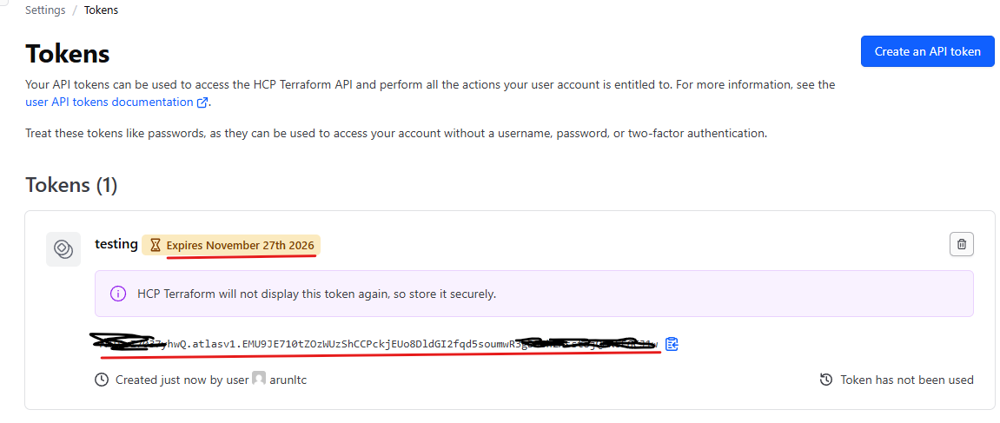

After adding the credentials, run Terraform again.

> **Production recommendation:** For production environments, prefer short-lived credentials, IAM roles, workload identity, or another supported federation mechanism over long-lived IAM user access keys.

---

## 10. Terraform Plan, Approval and Apply

After the AWS credentials are available, run:

```bash
terraform apply
```

HCP Terraform performs the Terraform operation remotely.

The source walkthrough shows that the run is visible in both the Terraform CLI and the HCP Terraform workspace. The plan completes successfully and Terraform then requests confirmation before applying the changes. fileciteturn0file0L75-L77

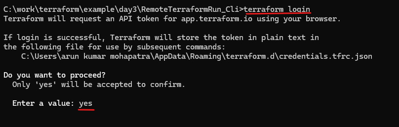

This provides an important control point:

```text
Terraform Configuration
        |
        v
   Terraform Plan
        |
        v
   Human Review
        |
        v
   Confirm & Apply
        |
        v
    AWS Resource
```


---

## 11. Verify the EC2 Instance in AWS

After the apply completes, verify the resource in the AWS console.

The walkthrough demonstrates that the EC2 instance is successfully created.

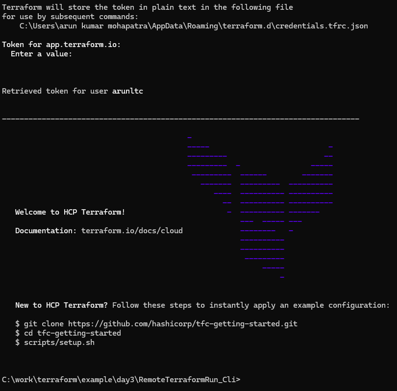

The successful Terraform run is also visible in the HCP Terraform workspace.

---

## 12. HCP Terraform Remote State

One of the major benefits of HCP Terraform is centralized remote state management.

With remote execution/state, the Terraform state is managed by HCP Terraform rather than being committed to the Git repository as a local `terraform.tfstate` file.

The source walkthrough explicitly demonstrates that a local `terraform.tfstate` file is not created because the state is managed by HCP Terraform. fileciteturn0file0L81-L83


### Why remote state matters

Remote state provides a better collaboration model because:

- State is centralized.
- Team members use the same state.
- State is not stored in Git.
- HCP Terraform can coordinate state locking.
- Run history is available centrally.
- Infrastructure changes can be audited through Terraform runs.

---

## 13. Make a Change to the Terraform Configuration

Terraform continuously compares the desired configuration with the known infrastructure state.

For example, add a new tag to the EC2 instance:

```hcl
tags = {
  Name        = "LTC-HYD-Linux-EC2"
  Project     = "LTC_HYD_PROJECT"
  ManagedBy   = "Terraform"
  CommandFrom = "GitHub"
  Environment = "LTC"
}
```

The source walkthrough demonstrates adding a new tag and then running Terraform again. fileciteturn0file0L85-L87

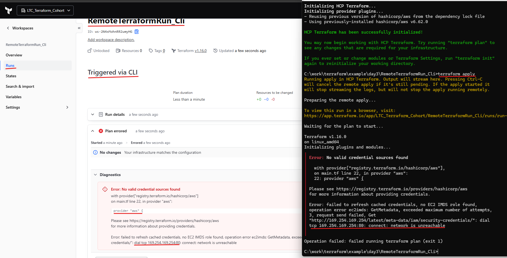

Terraform detects the difference and generates a plan describing the required change.


---

## 14. Terraform Destroy

Terraform can also remove infrastructure that is managed by Terraform.

Run:

```bash
terraform destroy
```

Terraform displays the resources that will be destroyed and asks for confirmation.

The walkthrough demonstrates the `terraform destroy` operation and the corresponding HCP Terraform run. fileciteturn0file0L89-L93

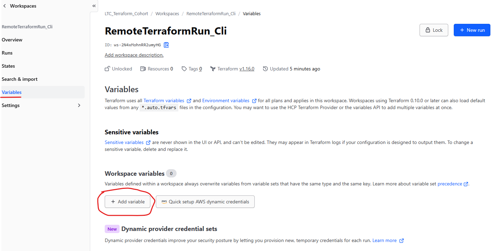


After confirmation, Terraform removes the managed resource.


The final HCP Terraform run history shows the completed operations.

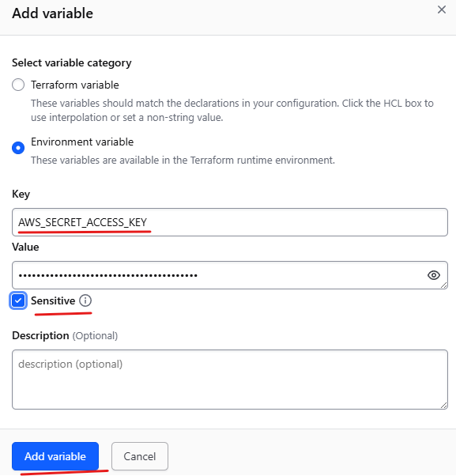

---

# GitOps with GitHub and HCP Terraform

The CLI-driven workflow above can be extended into a GitOps workflow by connecting the HCP Terraform workspace directly to a GitHub repository.

The recommended flow is:

```text
Developer
    |
    | git push
    v
Feature Branch
    |
    | Pull Request
    v
GitHub
    |
    | VCS Event
    v
HCP Terraform
    |
    | Speculative Plan
    v
Pull Request Review
    |
    | Merge
    v
main
    |
    | VCS-triggered Run
    v
HCP Terraform
    |
    | Terraform Plan
    v
Human Approval
    |
    | Confirm & Apply
    v
AWS
```

## GitOps Workspace Configuration

For a GitHub-connected HCP Terraform workspace, the recommended configuration is:

| Setting | Recommended value |
|---|---|
| VCS trigger type | **Branch-based** |
| VCS branch | `main` |
| Automatic run triggering | **Enabled** |
| Automatic speculative plans | **Enabled** |
| Auto-apply | **Disabled** |
| Execution mode | **Remote** |
| Working directory | Repository root or the Terraform directory |

### Pull Request behavior

A Pull Request should generate a **speculative Terraform plan**.

A speculative plan is useful for validating the proposed infrastructure change without applying it.

After the Pull Request is approved and merged into the workspace's configured branch, HCP Terraform can create a normal Terraform run.

With **Auto-apply disabled**, the normal run pauses after the plan and requires an authorized human to review and confirm the apply.

Therefore:

```text
Feature Branch
      |
      v
Pull Request
      |
      v
Speculative Plan
      |
      v
Code Review
      |
      v
Merge to main
      |
      v
Terraform Plan
      |
      v
Human Approval
      |
      v
Terraform Apply
```

---

# GitHub Repository Configuration

For a public GitHub repository, the HCP Terraform GitHub integration can be granted access to the specific repository.

A least-privilege configuration is preferable:

```text
Repository access
        |
        +-- Only selected repositories
                |
                +-- RemoteTerraformRun_GitHub
```

The GitHub integration should have the permissions required by the HCP Terraform VCS integration, including repository code/metadata/pull-request access and the ability to write commit status information when configured for PR feedback.

> **Important:** For the standard HCP Terraform VCS integration, you normally do **not** need to create a separate custom GitHub webhook manually. The VCS integration handles the required event integration.

---

# Recommended Enterprise GitOps Model

For an enterprise implementation, separate **PR validation** from **infrastructure deployment**.

```text
                    ┌──────────────────────┐
                    │      Developer       │
                    └──────────┬───────────┘
                               |
                               | git push
                               v
                    ┌──────────────────────┐
                    │   Feature Branch     │
                    └──────────┬───────────┘
                               |
                               | Pull Request
                               v
                    ┌──────────────────────┐
                    │       GitHub         │
                    │  Code Review + PR    │
                    └──────────┬───────────┘
                               |
                               v
                    ┌──────────────────────┐
                    │   HCP Terraform      │
                    │ Speculative Plan     │
                    └──────────┬───────────┘
                               |
                               | PR approved
                               v
                    ┌──────────────────────┐
                    │     Merge to main    │
                    └──────────┬───────────┘
                               |
                               v
                    ┌──────────────────────┐
                    │   HCP Terraform      │
                    │  Normal Plan Run     │
                    └──────────┬───────────┘
                               |
                               v
                    ┌──────────────────────┐
                    │  Human Approval      │
                    │   Confirm & Apply    │
                    └──────────┬───────────┘
                               |
                               v
                    ┌──────────────────────┐
                    │         AWS          │
                    │   Infrastructure     │
                    └──────────────────────┘
```

### Key principles

1. **GitHub is the source of truth** for Terraform configuration.
2. **Feature branches** isolate infrastructure changes.
3. **Pull requests** provide peer review.
4. **Speculative plans** validate proposed infrastructure changes.
5. **`main`** represents the approved configuration.
6. **HCP Terraform** performs remote Terraform execution.
7. **HCP Terraform** manages remote state.
8. **Human approval** controls the production apply.
9. **Auto-apply remains disabled** for controlled environments.
10. **AWS credentials remain outside Git**.

---

# Example Terraform Configuration

A simplified AWS example:

```hcl
terraform {
  required_version = ">= 1.6.0"

  cloud {
    organization = "YOUR_ORGANIZATION"

    workspaces {
      name = "YOUR_WORKSPACE"
    }
  }

  required_providers {
    aws = {
      source  = "hashicorp/aws"
      version = "~> 6.0"
    }
  }
}

provider "aws" {
  region = var.aws_region
}

data "aws_vpc" "default" {
  default = true
}

data "aws_subnet" "default" {
  availability_zone = var.availability_zone

  filter {
    name   = "vpc-id"
    values = [data.aws_vpc.default.id]
  }
}

data "aws_ami" "amazon_linux" {
  most_recent = true

  owners = ["amazon"]

  filter {
    name   = "name"
    values = ["al2023-ami-*-x86_64"]
  }

  filter {
    name   = "virtualization-type"
    values = ["hvm"]
  }
}

resource "aws_instance" "linux_ec2" {
  ami           = data.aws_ami.amazon_linux.id
  instance_type = var.instance_type
  subnet_id     = data.aws_subnet.default.id

  associate_public_ip_address = true

  tags = {
    Name        = "LTC-HYD-Linux-EC2"
    Project     = "LTC_HYD_PROJECT"
    ManagedBy   = "Terraform"
    CommandFrom = "GitHub"
  }
}
```

---

# Troubleshooting Checklist

If a Terraform run is not triggered from GitHub, check the following:

### GitHub

- [ ] The correct GitHub repository is connected.
- [ ] The GitHub App has access to the repository.
- [ ] The repository is the one configured in the HCP Terraform workspace.
- [ ] The Pull Request targets the workspace's configured branch.
- [ ] A new commit is pushed to the branch/PR.

### HCP Terraform

- [ ] The workspace is connected to the correct VCS repository.
- [ ] VCS trigger type is **Branch-based**.
- [ ] The configured VCS branch is correct.
- [ ] **Automatic run triggering** is enabled.
- [ ] **Automatic speculative plans** is enabled for PR validation.
- [ ] Auto-apply is intentionally enabled/disabled according to the environment.
- [ ] The workspace is not locked.
- [ ] The workspace has the required variables.

### AWS

- [ ] AWS credentials or workload identity are configured.
- [ ] The credentials have sufficient permissions.
- [ ] The AWS region is correct.
- [ ] The required subnet/VPC exists.

---

# Security Guidelines

Never commit secrets to this repository.

Do **not** store the following in GitHub:

```text
HCP Terraform API tokens
AWS_ACCESS_KEY_ID
AWS_SECRET_ACCESS_KEY
Private keys
Passwords
Client secrets
```

Use HCP Terraform workspace variables and mark sensitive values appropriately.

For production environments, consider:

- Least-privilege IAM
- Short-lived credentials
- IAM roles / workload identity
- Branch protection
- Mandatory Pull Request approvals
- Terraform policy checks
- Separate workspaces for environments
- Remote state
- State locking
- Centralized Terraform run history
- Audit logging

---

# Summary

This demonstration establishes the foundation for an enterprise GitOps approach to Infrastructure as Code:

```text
                    GitHub
                       |
              Source of Truth
                       |
                 Pull Request
                       |
              Speculative Plan
                       |
                 Code Review
                       |
                  Merge to main
                       |
                Terraform Plan
                       |
                Human Approval
                       |
               Terraform Apply
                       |
                     AWS
```

**GitHub manages the desired configuration. HCP Terraform manages remote execution and state. Human approval provides the deployment control point.**

This separation provides a clear and auditable path from a developer's infrastructure change to the actual cloud infrastructure.
