# HCP Terraform — Remote Execution and Remote State Management

This README documents the end-to-end setup demonstrated in the accompanying **HCP Terraform** walkthrough. The original document has been reviewed and the wording has been corrected for grammar, clarity, consistency, and technical readability while retaining the workflow and terminology used in the source material.

> **Scope:** The walkthrough covers account creation, organization/project/workspace setup, CLI-driven remote execution, API-token authentication, AWS credential configuration, remote state management, configuration changes, and resource destruction.

---

## Table of Contents

- [1. Overview](#1-overview)
- [2. Prerequisites](#2-prerequisites)
- [3. Create an HCP Terraform Account](#3-create-an-hcp-terraform-account)
- [4. Confirm the Account](#4-confirm-the-account)
- [5. Create an HCP Terraform Organization](#5-create-an-hcp-terraform-organization)
- [6. Create a Project](#6-create-a-project)
- [7. Create a Workspace](#7-create-a-workspace)
- [8. Configure the Terraform Cloud Block](#8-configure-the-terraform-cloud-block)
- [9. Create an HCP Terraform API Token](#9-create-an-hcp-terraform-api-token)
- [10. Authenticate the Terraform CLI](#10-authenticate-the-terraform-cli)
- [11. Initialize and Execute Terraform](#11-initialize-and-execute-terraform)
- [12. Configure AWS Credentials](#12-configure-aws-credentials)
- [13. Run Terraform Apply](#13-run-terraform-apply)
- [14. Verify Remote State Management](#14-verify-remote-state-management)
- [15. Make a Configuration Change](#15-make-a-configuration-change)
- [16. Destroy the Infrastructure](#16-destroy-the-infrastructure)
- [17. End-to-End Workflow](#17-end-to-end-workflow)
- [18. Security Recommendations](#18-security-recommendations)
- [19. Key Takeaways](#19-key-takeaways)

---

# 1. Overview

**HCP Terraform** provides centralized Terraform workspace management, remote execution, run history, variables, and remote state management.

The walkthrough demonstrates the following flow:

```text
Terraform CLI
     |
     | Authentication
     v
HCP Terraform
     |
     | CLI-driven remote run
     v
Terraform Workspace
     |
     +---- Remote State
     |
     +---- Workspace Variables
     |
     v
AWS Provider
     |
     v
AWS Resources
```

The practical example creates an **AWS EC2 instance**, updates its configuration, and finally destroys it.

---

# 2. Prerequisites

Before starting, ensure that you have:

- Terraform installed on your local machine.
- An HCP Terraform account.
- Access to an AWS account.
- Permission to create the AWS resources required by your Terraform configuration.
- A Terraform configuration that defines the required provider and resources.
- An HCP Terraform API token for CLI authentication.

---

# 3. Create an HCP Terraform Account

Open the HCP Terraform login page:

**https://app.terraform.io/login**

You can create an account using a username/email-based approach. If you already have a HashiCorp account, you can use that account. The walkthrough also demonstrates using **GitHub SSO**.

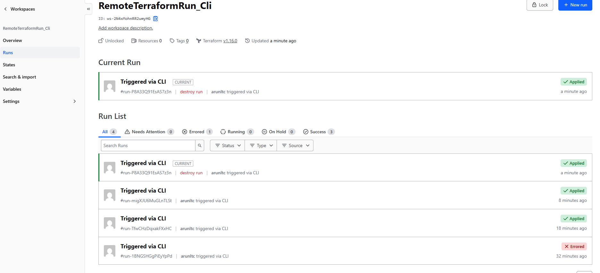

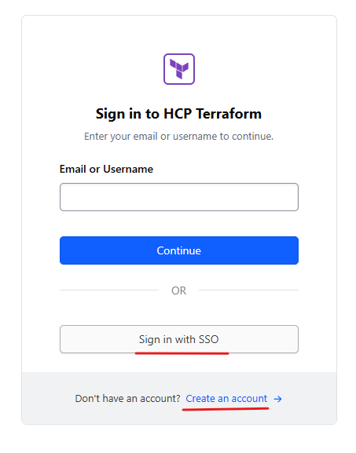

The account creation screen requires the username, email address, password, and acceptance of the applicable terms.

---

# 4. Confirm the Account

The walkthrough describes two ways to establish the HCP Terraform login:

1. **Email-based account creation and verification**
2. **GitHub SSO**

## Approach 1 — Email verification

After creating the account, HCP Terraform requires the email address to be confirmed.


The account confirmation screen provides the option to resend the confirmation link if required.

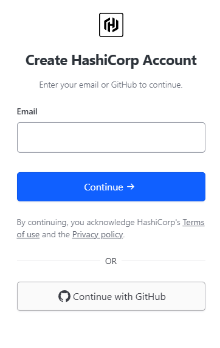

Open the confirmation email and select the confirmation link.

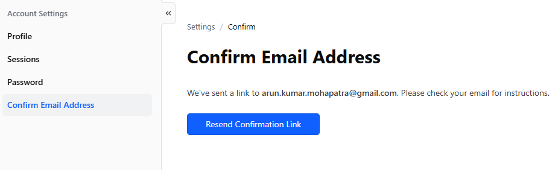

After confirmation, sign in using the email address used to create the HCP Terraform account.

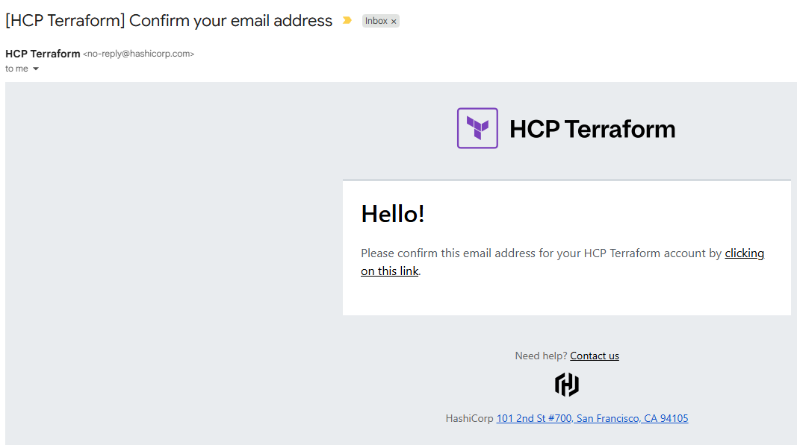

## Approach 2 — GitHub SSO

If GitHub is used for authentication, authorize HashiCorp to access the required GitHub account information.

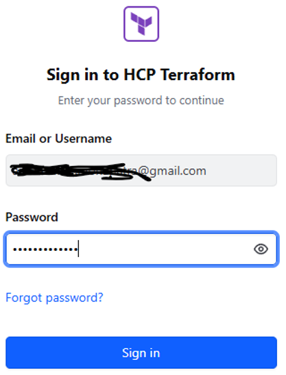

Authorize the HashiCorp application.

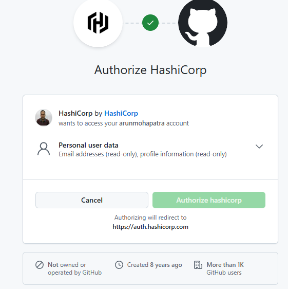

After authorization, HCP Terraform creates an HCP-linked account that can be used to access HashiCorp services.

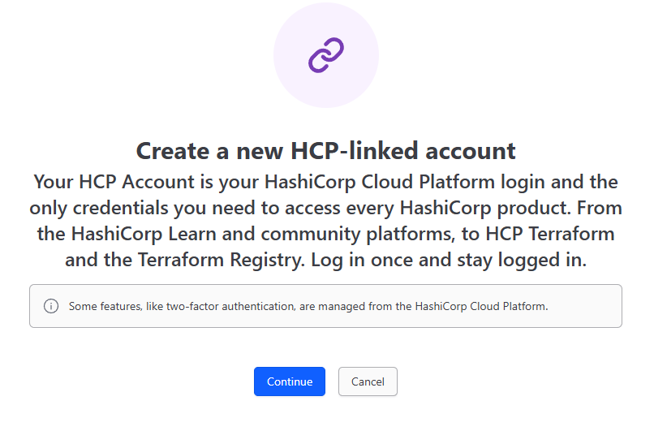

---

# 5. Create an HCP Terraform Organization

After logging in, create your first HCP Terraform organization.

Select **Create organization** and provide the required organization details.

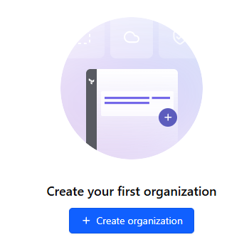

A new organization is created with a **Default Project**.

---

# 6. Create a Project

A workspace can be created under the default project, or a separate project can be created to organize related workspaces.

For this walkthrough, a new project is created.

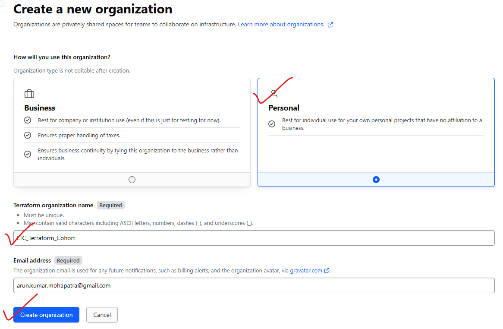

The project is then available in the organization's project list.


A useful logical structure is:

```text
Organization
└── Project
    └── Workspace
```

---

# 7. Create a Workspace

Create the workspace under the newly created project.

HCP Terraform provides three workspace workflow options:

| Workflow | Purpose |
|---|---|
| **Version Control Workflow** | Runs Terraform based on changes in a connected source-control repository such as GitHub or Bitbucket. |
| **CLI-Driven Workflow** | Uses the Terraform CLI to trigger Terraform runs in HCP Terraform. |
| **API-Driven Workflow** | Uses the HCP Terraform API and is commonly used for custom CI/CD integrations. |

For this walkthrough, select **CLI-Driven Workflow**.


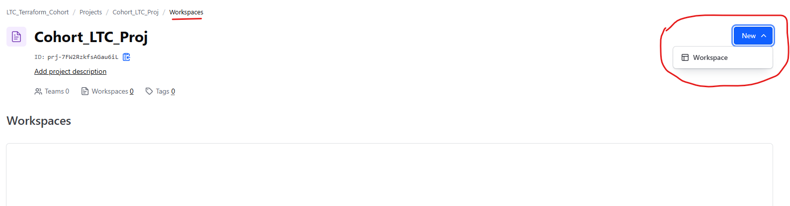

Provide a workspace name under **Configuration Settings**, select the project, and click **Create**.


The workspace is then created under the selected project.


---

# 8. Configure the Terraform Cloud Block

The HCP Terraform workspace provides a Terraform configuration snippet that connects the local Terraform configuration to the remote workspace.

An example from the walkthrough is:

```hcl
terraform {
  required_version = ">= 1.16.0"

  cloud {
    organization = "LTC_Terraform_Cohort"

    workspaces {
      name = "RemoteTerraformRun_CLI"
    }
  }

  required_providers {
    aws = {
      source  = "hashicorp/aws"
      version = "~> 6.0"
    }
  }
}
```

Add the appropriate HCP Terraform configuration to your Terraform code.

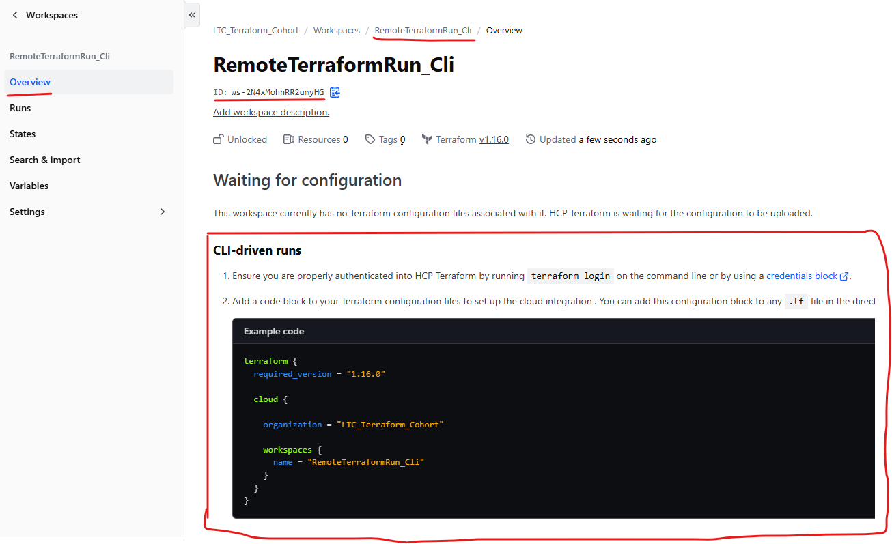

The important relationship is:

```text
Terraform CLI
     |
     v
HCP Terraform Organization
     |
     v
HCP Terraform Workspace
```

> **Note:** Replace the example organization and workspace names with the names used in your own HCP Terraform environment.

---

# 9. Create an HCP Terraform API Token

The Terraform CLI must authenticate with HCP Terraform before it can trigger remote runs.

Navigate to the account token settings and select **Create an API token**.

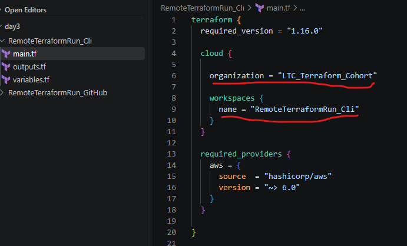

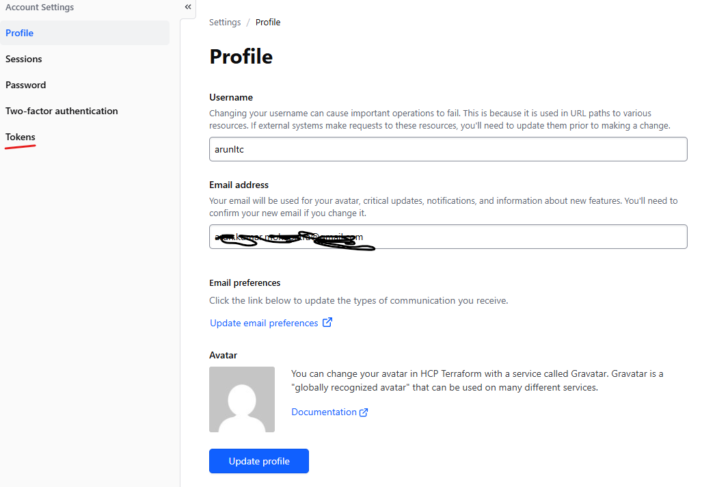

Specify how long the token should remain valid.

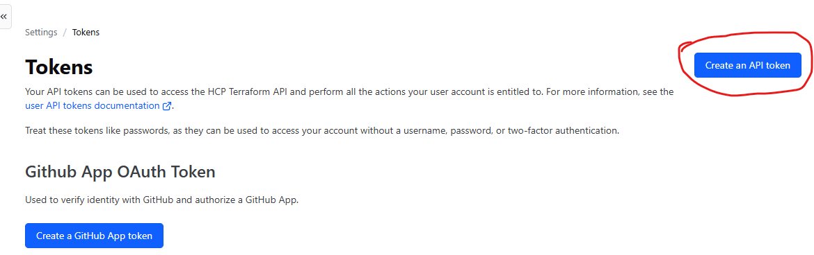

Enter a description and click **Generate Token**.

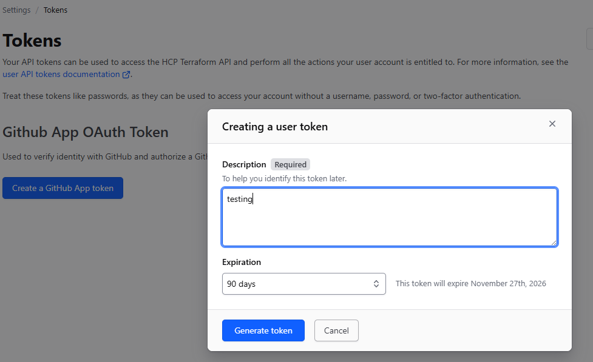

Copy the token immediately after it is generated.

**Important:** Do not share the token or commit it to source control. Treat it as a password.

---

# 10. Authenticate the Terraform CLI

On your local machine, execute:

```bash
terraform login
```

Terraform asks whether it should proceed with authentication.


Enter:

```text
yes
```

Terraform then asks you to provide the token for `app.terraform.io`.


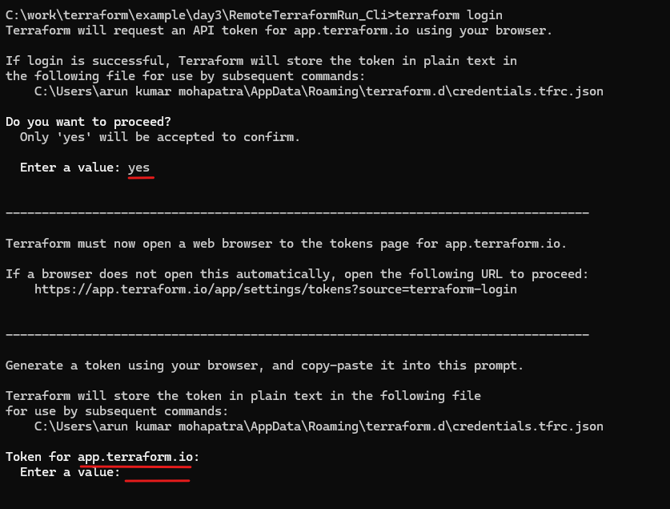

Enter the API token generated in HCP Terraform.

If authentication succeeds, Terraform confirms that the token has been retrieved and the CLI can communicate with HCP Terraform.

The walkthrough shows Terraform storing the credentials locally for subsequent commands.

---

# 11. Initialize and Execute Terraform

After authentication, initialize the Terraform working directory:

```bash
terraform init
```

Terraform downloads the required providers and initializes the HCP Terraform integration.


You can then run:

```bash
terraform plan
```

or:

```bash
terraform apply
```

The Terraform CLI triggers a run in the configured HCP Terraform workspace.

---

# 12. Configure AWS Credentials

The example Terraform configuration creates an AWS EC2 instance.

When Terraform runs remotely in HCP Terraform, the workspace must have permission to authenticate to AWS.

If AWS credentials have not been configured, the remote run fails because HCP Terraform cannot authenticate with AWS.

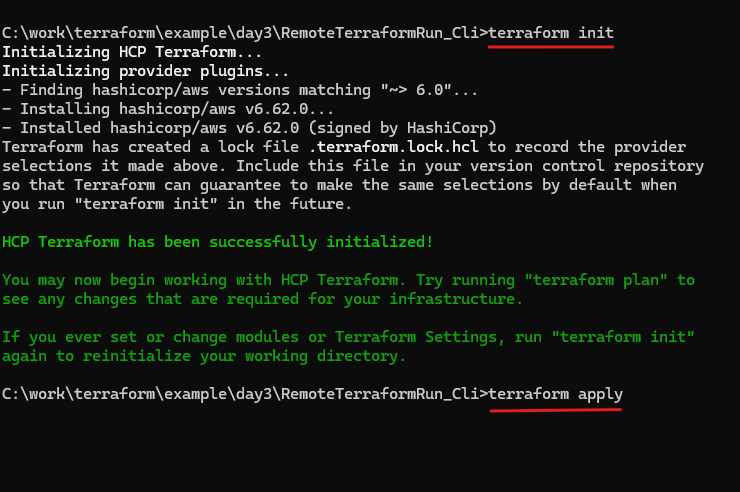

The walkthrough demonstrates the failed run and the resulting error.


## Fix the error

Open the HCP Terraform workspace and navigate to:

**Variables → Add variable**

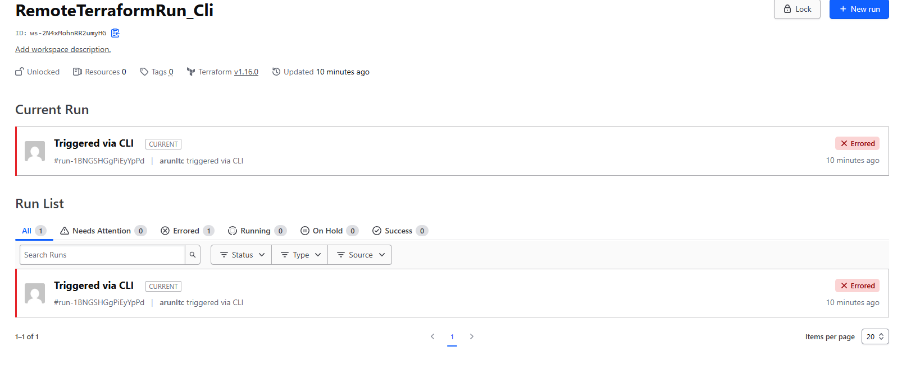

Add the required AWS credentials as **Environment Variables**.

Typical variables include:

```text
AWS_ACCESS_KEY_ID
AWS_SECRET_ACCESS_KEY
```

Mark sensitive credentials as **Sensitive**.


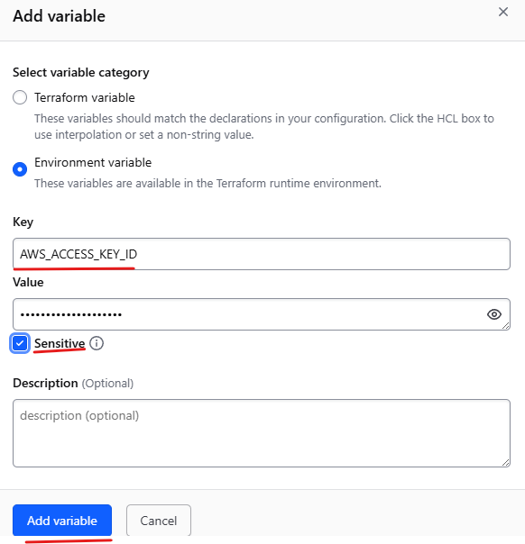

After adding the credentials, verify that the variables are present in the workspace and marked sensitive.


> **Security:** Never hard-code AWS credentials in Terraform source code and never commit them to GitHub.

---

# 13. Run Terraform Apply

Run the apply operation again:

```bash
terraform apply
```

The Terraform CLI triggers a remote run in HCP Terraform.

The walkthrough demonstrates that the **run ID displayed by the CLI and the run shown in the HCP Terraform console correspond to the same operation**.

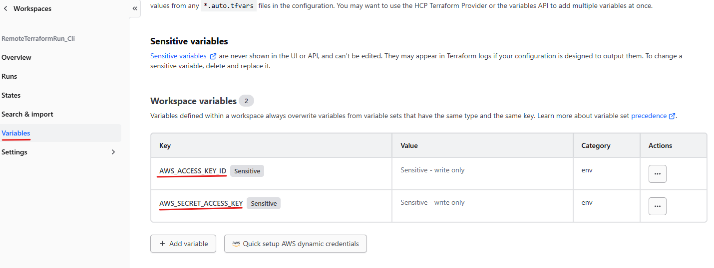

The plan is successful, but Terraform requests confirmation before applying the changes.

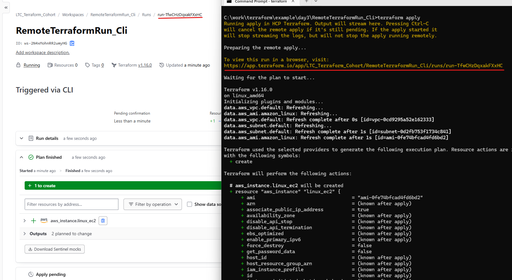

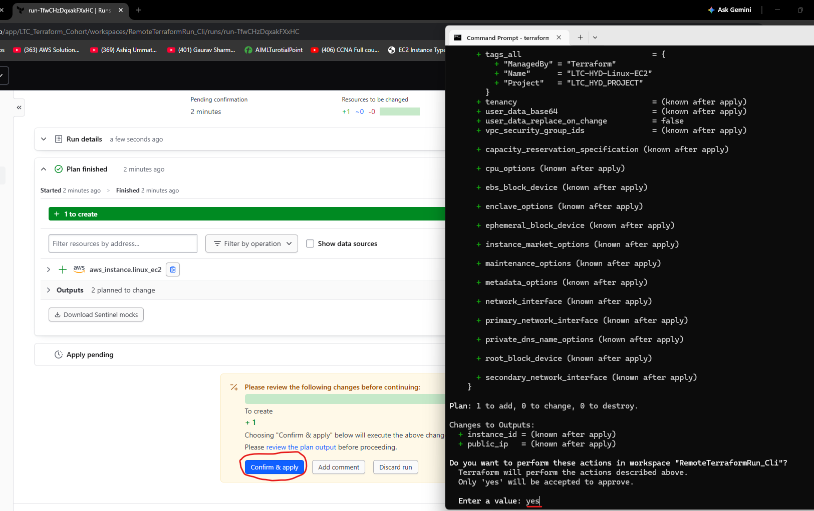

Once confirmed, HCP Terraform executes the changes.

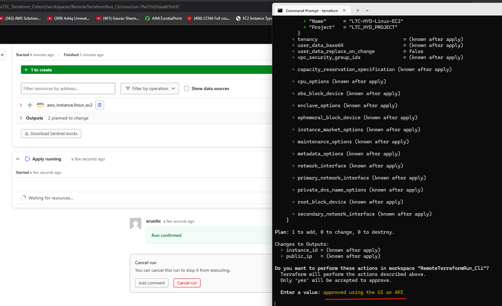

The AWS console can then be used to verify that the EC2 instance has been created.

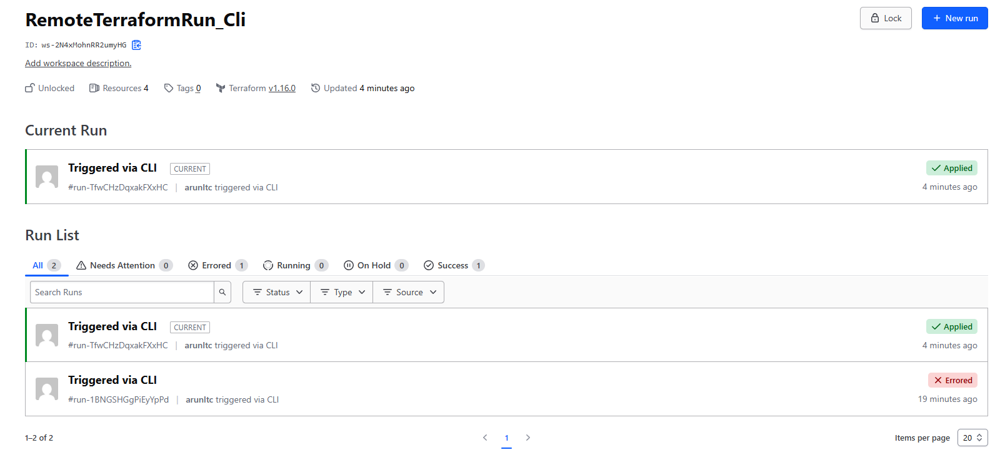

---

# 14. Verify Remote State Management

With HCP Terraform configured for remote execution, Terraform state is managed by HCP Terraform.

The walkthrough verifies that a local:

```text
terraform.tfstate
```

file is not created in the working directory because the state is maintained remotely.

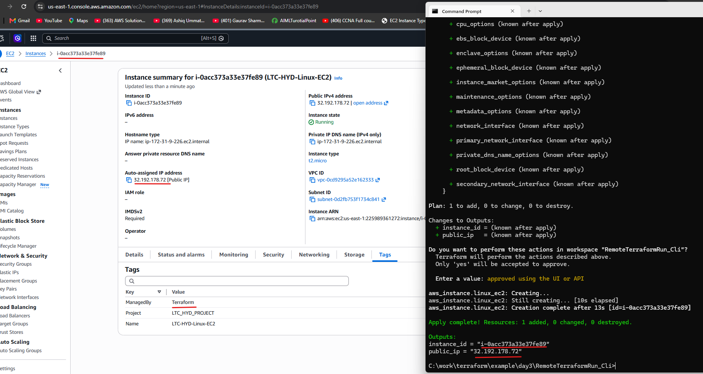

Conceptually:

```text
Local Terraform CLI
        |
        | Remote execution
        v
HCP Terraform Workspace
        |
        +---- Remote Terraform State
        |
        v
       AWS
```

This centralizes state management in the HCP Terraform workspace instead of maintaining the state file locally.

---

# 15. Make a Configuration Change

To demonstrate the update workflow, modify the Terraform configuration by adding a new tag to the EC2 instance.

The walkthrough adds a tag similar to:

```hcl
tags = {
  Name      = "LTC-HYD-Linux-EC2"
  Project   = "LTC_HYD_PROJECT"
  ManagedBy = "Terraform"
  This_is   = "LTC"
}
```

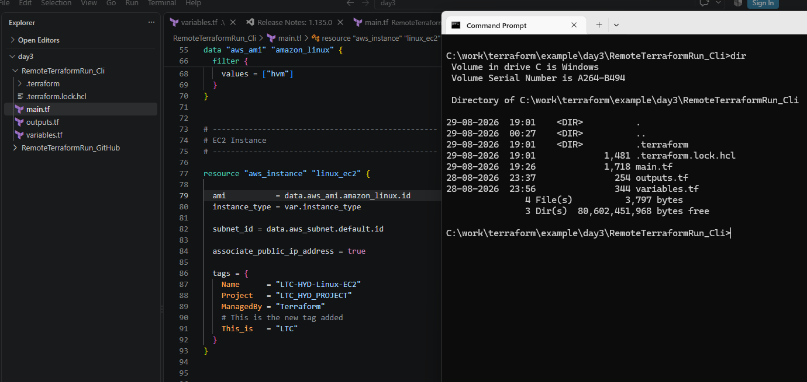

Run:

```bash
terraform apply
```

HCP Terraform detects the configuration change and creates a new remote run.

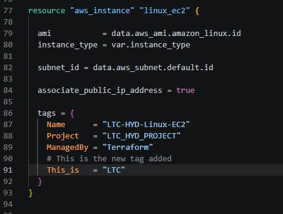

The plan shows the tag update.

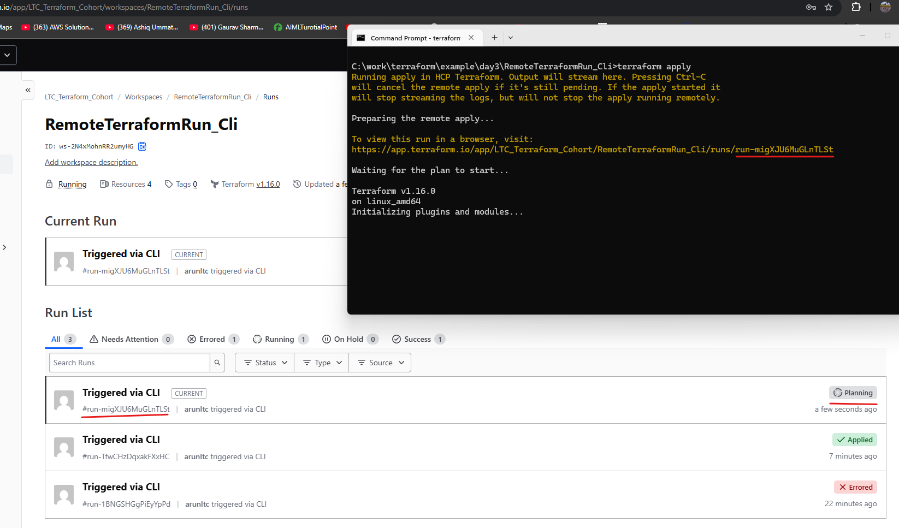

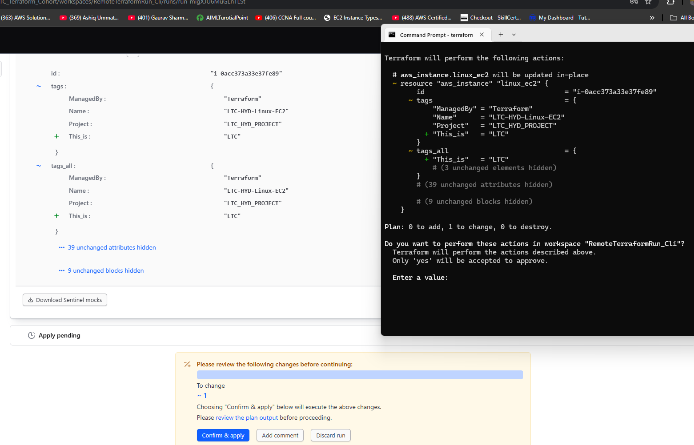

After the run completes, verify the new tag in the AWS console.

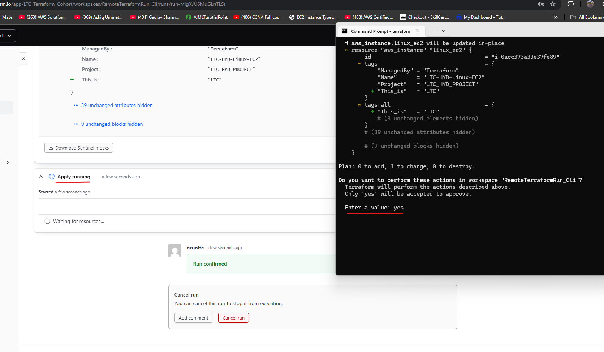

This demonstrates the change-management flow:

```text
Modify Terraform configuration
             |
             v
      terraform apply
             |
             v
       HCP Terraform
             |
             v
      Remote Terraform Run
             |
             v
        AWS Resource
```

---

# 16. Destroy the Infrastructure

To remove the EC2 instance managed by Terraform, run:

```bash
terraform destroy
```

The command creates a destruction plan and requests confirmation.

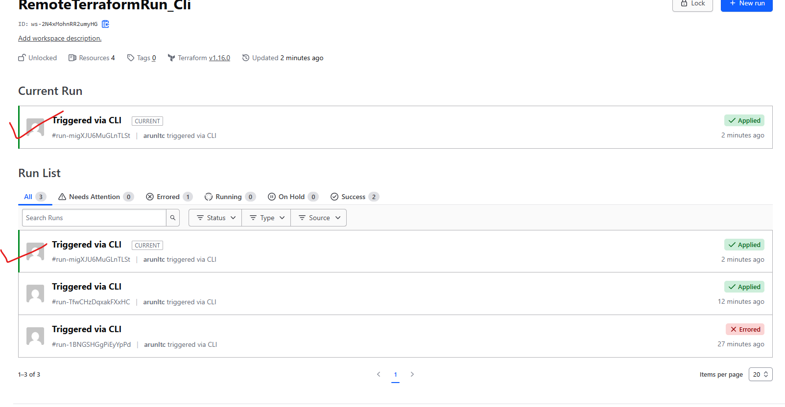

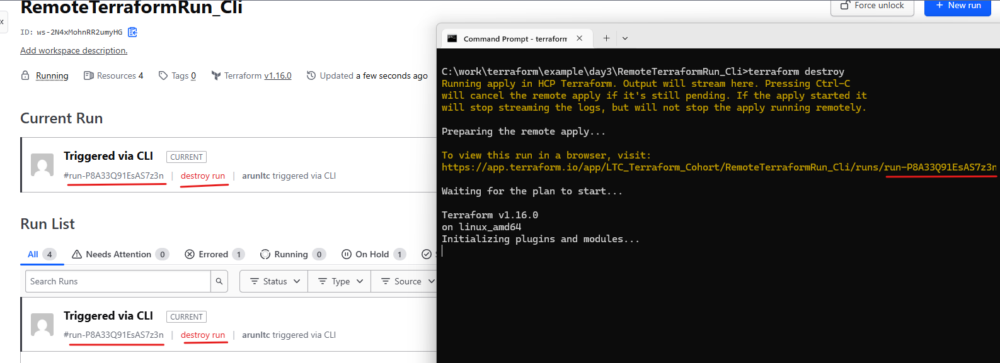

Confirm the destruction operation.

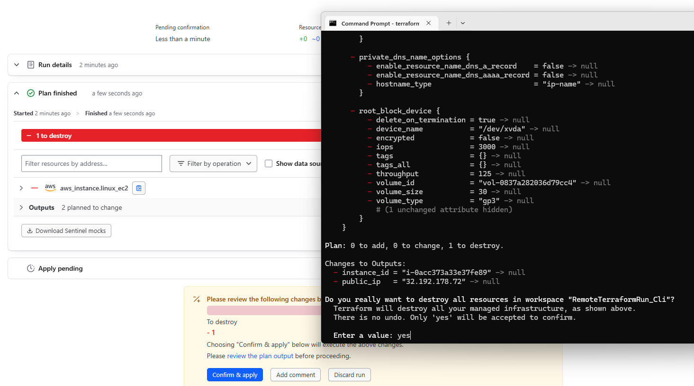

HCP Terraform executes the destroy operation remotely.

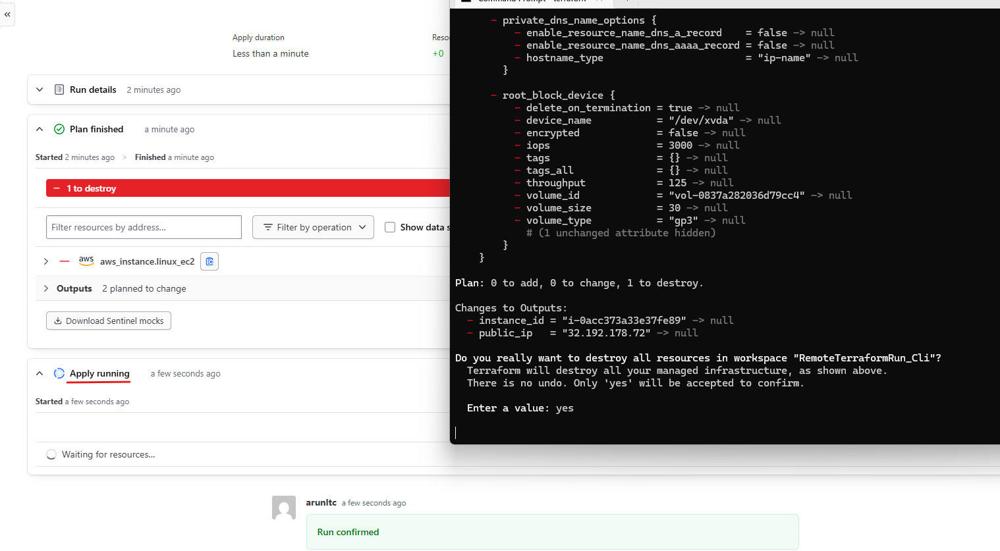

After the operation completes, Terraform reports that the resource has been destroyed.

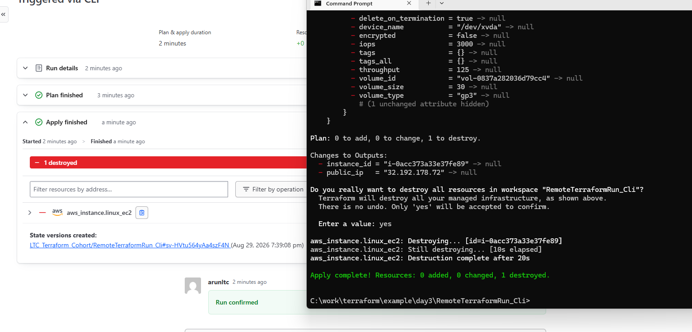

The AWS console can then be used to verify that the EC2 resource has been removed.

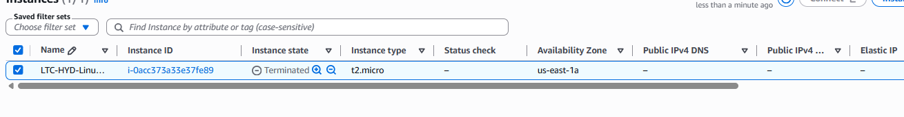

The HCP Terraform workspace retains the run history, allowing previous successful and failed runs to be reviewed.

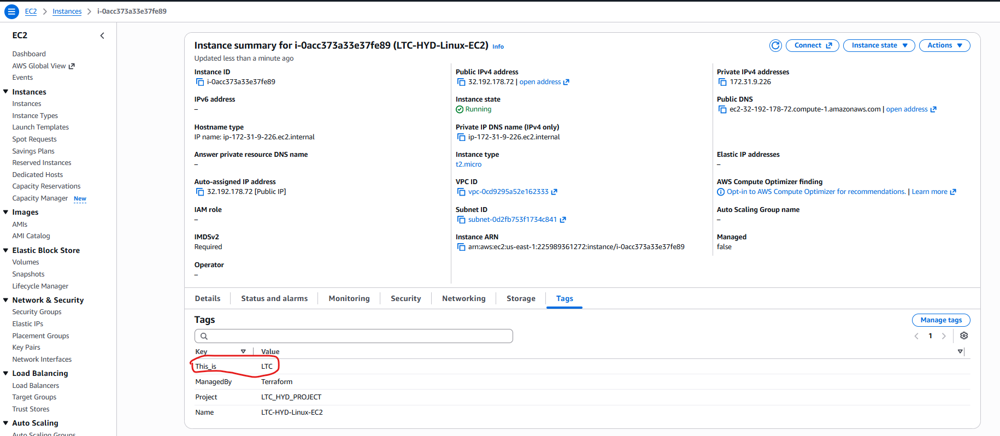

---

# 17. End-to-End Workflow

The complete workflow demonstrated in the document can be summarized as follows:

```text
+---------------------------+
| Create HCP Terraform     |
| Account                   |
+-------------+-------------+
              |
              v
+---------------------------+
| Create Organization       |
+-------------+-------------+
              |
              v
+---------------------------+
| Create Project            |
+-------------+-------------+
              |
              v
+---------------------------+
| Create Workspace          |
| CLI-Driven Workflow       |
+-------------+-------------+
              |
              v
+---------------------------+
| Configure Terraform       |
| cloud block               |
+-------------+-------------+
              |
              v
+---------------------------+
| Create HCP API Token      |
+-------------+-------------+
              |
              v
+---------------------------+
| terraform login           |
+-------------+-------------+
              |
              v
+---------------------------+
| terraform init            |
+-------------+-------------+
              |
              v
+---------------------------+
| Configure AWS Credentials |
| as sensitive variables    |
+-------------+-------------+
              |
              v
+---------------------------+
| terraform plan/apply      |
+-------------+-------------+
              |
              v
+---------------------------+
| AWS EC2 Instance Created  |
+-------------+-------------+
              |
              v
+---------------------------+
| Modify Terraform          |
| Configuration             |
+-------------+-------------+
              |
              v
+---------------------------+
| terraform apply            |
+-------------+-------------+
              |
              v
+---------------------------+
| AWS Resource Updated      |
+-------------+-------------+
              |
              v
+---------------------------+
| terraform destroy         |
+-------------+-------------+
              |
              v
+---------------------------+
| AWS Resource Removed      |
+---------------------------+
```

---

# 18. Security Recommendations

The source walkthrough demonstrates API tokens and AWS credentials. For a production implementation, follow these practices:

- **Never commit HCP Terraform API tokens to GitHub.**
- **Never commit AWS access keys or secret keys to GitHub.**
- Store credentials as sensitive HCP Terraform workspace variables or use an appropriate dynamic/cloud credential mechanism.
- Use short-lived credentials where possible.
- Set appropriate expiration periods for API tokens.
- Rotate credentials regularly.
- Follow least-privilege permissions for AWS identities.
- Use separate workspaces for different environments where appropriate.
- Protect production workspaces with appropriate access controls and approval mechanisms.
- Remove or rotate credentials that may have been exposed in screenshots or documentation.
- Avoid including real personal email addresses, tokens, account identifiers, or other secrets in repository documentation.

---

# 19. Key Takeaways

### Remote Terraform Execution

The Terraform CLI can be used as the interface while HCP Terraform manages the remote Terraform run.

### Remote State

HCP Terraform manages the Terraform state remotely, avoiding the need to maintain a local `terraform.tfstate` file for this workflow.

### Workspace Variables

AWS credentials required by the remote run can be configured at the HCP Terraform workspace level and marked as sensitive.

### Run Visibility

The Terraform CLI and HCP Terraform console provide visibility into the same remote Terraform run.

### Infrastructure Lifecycle

The demonstrated workflow supports the complete lifecycle:

```bash
terraform init
terraform plan
terraform apply
terraform destroy
```

### Organization Structure

HCP Terraform provides a structured hierarchy:

```text
Organization
    |
    +-- Project
          |
          +-- Workspace
                |
                +-- Variables
                +-- Runs
                +-- Remote State
```

---

## Conclusion

This walkthrough demonstrates how HCP Terraform can be used to provide **centralized remote Terraform execution and remote state management**.

The example starts with account and workspace creation, authenticates the Terraform CLI, configures AWS credentials, creates an EC2 instance, updates its configuration, and finally destroys the infrastructure.

The resulting workflow provides a foundation for integrating Terraform into a broader **GitHub/CI/CD-based infrastructure automation process**, while keeping Terraform execution and state management centralized in HCP Terraform.
